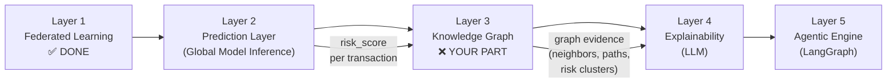
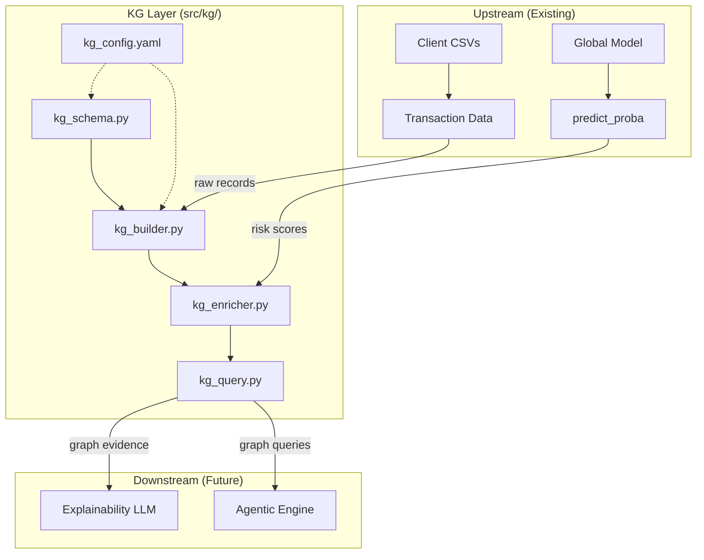

# Knowledge Graph Implementation Plan — Layer 3

## Goal

Build a **domain-agnostic Knowledge Graph (KG) layer** that:
1. Receives risk scores from the global FL model (Layer 2)
2. Constructs a relational graph of entities (accounts, transactions, merchants, etc.)
3. Enriches predictions with **relational context** (e.g., "this account connects to 3 flagged merchants")
4. Exposes query APIs for the downstream Explainability (Layer 4) and Agentic (Layer 5) layers
5. Remains domain-agnostic — swap fraud entities for hospital/cybersecurity entities by changing config, not code

---

## Where KG Fits in the Full Architecture



### What the KG Receives (Input)
- **Transaction records** with features (from client CSV data)
- **Risk scores** produced by the global model's `predict_proba()` function
- **Entity metadata** extracted from the dataset (accounts, merchants, amounts, timestamps)

### What the KG Produces (Output)
- **Graph evidence** for each flagged transaction:
  - Connected entities and their risk profiles
  - Suspicious neighborhood statistics
  - Path analysis (e.g., money flowing through high-risk merchants)
  - Cluster membership (risk communities)
- **Structured context dict** that Layer 4 (LLM) can consume to generate explanations

---

## Architecture Overview



---

## Domain-Agnostic Design Principle

> [!IMPORTANT]
> The KG code must **never hardcode** entity names like "account", "merchant", or "transaction". Instead, all entity types, relationship types, and attribute mappings are defined in `configs/kg_config.yaml`. Changing domains means editing the config, not the Python code.

### How It Stays Generic

| Concern | Fraud Domain Example | Hospital Domain Example | Defined In |
|---------|---------------------|------------------------|-----------|
| Entity types | `account`, `merchant`, `transaction` | `patient`, `hospital`, `diagnosis` | `kg_config.yaml` |
| Relationship types | `SENT_TO`, `TRANSACTED_AT`, `LINKED_ACCOUNT` | `TREATED_AT`, `DIAGNOSED_WITH` | `kg_config.yaml` |
| Node ID column | `cc_num` or auto-generated | `patient_id` | `kg_config.yaml` |
| Risk score column | `fraud_risk_score` | `disease_risk_score` | `kg_config.yaml` |
| Edge weight source | `Amount` | `treatment_cost` | `kg_config.yaml` |

---

## Proposed File Structure

```
src/kg/                          # NEW — Knowledge Graph module
├── __init__.py                  # Package init, exports
├── kg_schema.py                 # Entity/relationship type definitions (from config)
├── kg_builder.py                # Build graph from transaction data + predictions
├── kg_enricher.py               # Add risk scores, compute graph features
├── kg_query.py                  # Query API for explainability/agentic layers
└── kg_analytics.py              # Community detection, centrality, risk propagation

src/main/
├── run_kg_pipeline.py           # NEW — End-to-end KG runner
└── run_kg_query_demo.py         # NEW — Demo: query a flagged transaction

configs/
└── kg_config.yaml               # NEW — KG entity/relationship/attribute config

artifacts/
└── knowledge_graph/             # NEW — Saved graph artifacts
    ├── fraud_kg.graphml          # Serialized graph
    ├── kg_build_report.json      # Build statistics
    └── kg_enrichment_report.json # Enrichment statistics
```

---

## Detailed File Specifications

### 1. `configs/kg_config.yaml` — KG Configuration

```yaml
# Knowledge Graph Configuration — Domain-Agnostic
# Change entity/relationship definitions here to switch domains.
# No Python code changes required.

kg:
  name: "fraud_detection_kg"
  version: "1.0.0"
  domain: "fraud_detection"

  # --- Entity Definitions ---
  entities:
    - type: "transaction"
      id_column: "_row_index"        # auto-generated row index
      attributes:
        - column: "Amount"
          attr_name: "amount"
        - column: "Time"
          attr_name: "timestamp"
      label_column: "Class"           # ground truth if available
      risk_score_attr: "risk_score"   # attached by enricher

    - type: "amount_bucket"
      derived: true                   # created by builder, not from a column
      bucket_column: "Amount"
      bucket_edges: [0, 50, 200, 1000, 5000, 999999]
      bucket_labels: ["micro", "small", "medium", "large", "whale"]

    - type: "time_window"
      derived: true
      bucket_column: "Time"
      bucket_count: 24                # 24 time windows

  # --- Relationship Definitions ---
  relationships:
    - type: "HAS_AMOUNT_BUCKET"
      source_entity: "transaction"
      target_entity: "amount_bucket"

    - type: "IN_TIME_WINDOW"
      source_entity: "transaction"
      target_entity: "time_window"

    - type: "SIMILAR_PATTERN"
      source_entity: "transaction"
      target_entity: "transaction"
      similarity_features: ["V1", "V2", "V3", "V14", "V17"]
      similarity_threshold: 0.85

  # --- Risk Propagation ---
  risk:
    high_risk_threshold: 0.7         # risk_score >= 0.7 = high risk
    medium_risk_threshold: 0.4
    propagation_method: "neighbor_average"
    propagation_hops: 2

  # --- Analytics ---
  analytics:
    community_detection: "louvain"
    centrality_metric: "degree"
    top_k_suspicious: 50

  # --- Output ---
  output:
    graph_format: "graphml"
    artifacts_dir: "artifacts/knowledge_graph"
```

> [!NOTE]
> For the MLG-ULB dataset (anonymized V1–V28 features), we can't extract real "account" or "merchant" entities because those columns don't exist. Instead, the KG creates **derived entities** (amount buckets, time windows, pattern clusters) and connects transactions through them. When you switch to the Kartik dataset (which has real merchant/category/state columns), you just add those entity types to the config.

---

### 2. `src/kg/kg_schema.py` — Schema Definitions

**What it does**: Reads `kg_config.yaml` and creates Python dataclasses for entity types, relationship types, and their attributes. This is the KG equivalent of `src/data/schema.py` in the FL layer.

**Key classes**:
```python
@dataclass
class EntityType:
    name: str                  # e.g., "transaction", "amount_bucket"
    id_column: str             # column used as node ID
    attributes: List[dict]     # [{column, attr_name}, ...]
    derived: bool = False      # True if entity is computed, not from raw data
    label_column: str = None
    risk_score_attr: str = "risk_score"

@dataclass
class RelationshipType:
    name: str                  # e.g., "HAS_AMOUNT_BUCKET"
    source_entity: str
    target_entity: str
    weight_column: str = None
    similarity_features: List[str] = None
    similarity_threshold: float = 0.8

@dataclass
class KGSchema:
    name: str
    version: str
    domain: str
    entity_types: List[EntityType]
    relationship_types: List[RelationshipType]
    risk_config: dict
    analytics_config: dict

    @classmethod
    def from_config(cls, config_path: str) -> "KGSchema": ...
    def validate(self, df: pd.DataFrame) -> Tuple[bool, List[str]]: ...
```

---

### 3. `src/kg/kg_builder.py` — Graph Construction

**What it does**: Takes a DataFrame (transactions + risk scores) and builds a NetworkX graph based on the schema.

**Step-by-step process**:
1. **Create transaction nodes**: One node per row, with attributes from config
2. **Create derived entity nodes**: Amount buckets, time windows, etc.
3. **Create relationship edges**: Connect transactions to their bucket/window nodes
4. **Create similarity edges**: Connect transactions with similar feature patterns (cosine similarity on selected features)
5. **Return** a populated `nx.Graph` object

**Key class**:
```python
class KnowledgeGraphBuilder:
    def __init__(self, schema: KGSchema):
        self.schema = schema
        self.graph = nx.Graph()

    def build(self, df: pd.DataFrame) -> nx.Graph:
        """Build the full KG from a transaction DataFrame."""
        self._add_transaction_nodes(df)
        self._add_derived_entities(df)
        self._add_relationships(df)
        self._add_similarity_edges(df)
        return self.graph

    def _add_transaction_nodes(self, df): ...
    def _add_derived_entities(self, df): ...
    def _add_relationships(self, df): ...
    def _add_similarity_edges(self, df): ...

    def save(self, path: str): ...

    @classmethod
    def load(cls, path: str, schema: KGSchema) -> "KnowledgeGraphBuilder": ...
```

---

### 4. `src/kg/kg_enricher.py` — Risk Score Enrichment

**What it does**: Takes the built graph + global model predictions → attaches risk scores to transaction nodes → propagates risk through the graph.

**Step-by-step process**:
1. **Load global model** from `FINAL_global_model.pt`
2. **Load preprocessor** from `artifacts/preprocessors/`
3. **Run inference** on the transaction data → get `risk_score` per transaction
4. **Attach risk scores** as node attributes
5. **Propagate risk**: For each node, compute `neighborhood_risk` = average risk of neighbors within N hops
6. **Label risk tiers**: high / medium / low based on thresholds from config
7. **Save enriched graph**

**Key class**:
```python
class KGEnricher:
    def __init__(self, schema: KGSchema):
        self.schema = schema

    def attach_predictions(
        self, graph: nx.Graph, risk_scores: np.ndarray
    ) -> nx.Graph:
        """Attach model risk scores to transaction nodes."""

    def propagate_risk(
        self, graph: nx.Graph, hops: int = 2
    ) -> nx.Graph:
        """Propagate risk through graph neighborhoods."""

    def label_risk_tiers(self, graph: nx.Graph) -> nx.Graph:
        """Label nodes as high/medium/low risk."""

    def compute_enrichment_stats(self, graph: nx.Graph) -> dict:
        """Report: how many high-risk nodes, avg neighborhood risk, etc."""
```

**This is the critical integration point** — it connects the FL global model to the KG.

---

### 5. `src/kg/kg_query.py` — Query API

**What it does**: Provides a clean API that Layer 4 (LLM) and Layer 5 (Agentic) can call to get graph evidence for any transaction.

**Key queries**:

```python
class KGQueryEngine:
    def __init__(self, graph: nx.Graph, schema: KGSchema):
        self.graph = graph
        self.schema = schema

    def get_transaction_context(self, transaction_id: str) -> dict:
        """Get full context for a single transaction.

        Returns:
            {
                "transaction_id": "txn_12345",
                "risk_score": 0.92,
                "risk_tier": "high",
                "neighborhood_risk": 0.78,
                "amount_bucket": "large",
                "time_window": "window_3",
                "connected_high_risk_count": 5,
                "similar_transactions": [...],
                "community_id": 7,
                "community_risk_avg": 0.65,
                "evidence_summary": "..."
            }
        """

    def get_high_risk_subgraph(self, threshold: float = 0.7) -> nx.Graph:
        """Extract subgraph of all high-risk nodes and their connections."""

    def get_similar_flagged_transactions(
        self, transaction_id: str, top_k: int = 5
    ) -> List[dict]:
        """Find transactions with similar patterns that were also flagged."""

    def get_risk_path(
        self, source_id: str, target_id: str
    ) -> List[dict]:
        """Find shortest path between two transactions through the graph."""

    def get_community_summary(self, community_id: int) -> dict:
        """Summarize a risk community: size, avg risk, top members."""

    def generate_evidence_bundle(self, transaction_id: str) -> dict:
        """Generate the complete evidence bundle for the Explainability layer.

        This is the MAIN OUTPUT consumed by Layer 4 (LLM).
        """
```

---

### 6. `src/kg/kg_analytics.py` — Graph Analytics

**What it does**: Runs graph-level analytics — community detection, centrality, risk pattern discovery.

```python
class KGAnalytics:
    def __init__(self, graph: nx.Graph):
        self.graph = graph

    def detect_communities(self, method: str = "louvain") -> dict:
        """Detect risk communities using Louvain/Girvan-Newman."""

    def compute_centrality(self, metric: str = "degree") -> dict:
        """Find the most connected/influential nodes."""

    def find_risk_clusters(self, min_cluster_size: int = 3) -> List[dict]:
        """Find clusters where avg risk exceeds threshold."""

    def get_graph_summary(self) -> dict:
        """Overall graph stats: nodes, edges, density, components, etc."""
```

---

### 7. `src/main/run_kg_pipeline.py` — Runner Script

**What it does**: End-to-end runner: load data → load model → predict → build graph → enrich → analyze → save.

```python
def main():
    # Step 1: Load KG config
    schema = KGSchema.from_config("configs/kg_config.yaml")

    # Step 2: Load transaction data (global test set or any dataset)
    df = pd.read_csv("data/splits/global_test.csv")

    # Step 3: Load global model + preprocessor → generate risk scores
    preprocessor = ClientPreprocessor.load("artifacts/preprocessors/global_preprocessor.pkl")
    model = create_model(input_dim=preprocessor.get_feature_dim(), config=model_config)
    model.set_parameters(best_params)
    X, y = preprocessor.transform(df)
    risk_scores = predict_proba(model, X, device="cpu")

    # Step 4: Build Knowledge Graph
    builder = KnowledgeGraphBuilder(schema)
    graph = builder.build(df)

    # Step 5: Enrich with risk scores
    enricher = KGEnricher(schema)
    graph = enricher.attach_predictions(graph, risk_scores)
    graph = enricher.propagate_risk(graph, hops=2)
    graph = enricher.label_risk_tiers(graph)

    # Step 6: Run analytics
    analytics = KGAnalytics(graph)
    communities = analytics.detect_communities()
    centrality = analytics.compute_centrality()
    clusters = analytics.find_risk_clusters()

    # Step 7: Save everything
    builder.save("artifacts/knowledge_graph/fraud_kg.graphml")
    # Save reports...

    # Step 8: Demo query
    query_engine = KGQueryEngine(graph, schema)
    flagged = [nid for nid, d in graph.nodes(data=True) if d.get("risk_tier") == "high"]
    if flagged:
        evidence = query_engine.generate_evidence_bundle(flagged[0])
        print(json.dumps(evidence, indent=2))
```

---

## Integration Points with Existing Code

| What the KG Needs | Where It Comes From | How to Access |
|---|---|---|
| Transaction data (DataFrame) | `data/splits/global_test.csv` or client CSVs | `pd.read_csv(...)` |
| Risk scores (probabilities) | Global model via `predict_proba()` | Load model from `FINAL_global_model.pt`, preprocessor from `artifacts/preprocessors/`, call `predict_proba()` |
| Feature columns | `configs/mapping.json` | Read `mapping.json` for numeric/categorical lists |
| Model config | `configs/model_config.yaml` | YAML load |
| Preprocessor | `ClientPreprocessor` class | `ClientPreprocessor.load("artifacts/preprocessors/global_preprocessor.pkl")` |

> [!WARNING]
> Before starting KG work, the import path bugs (bugs 1–4 in the status report) **must be fixed**. The KG runner will need to import `create_model` and `predict_proba` from the correct paths. Fix by either:
> - Creating `src/models/mlp.py` as a re-export shim: `from src.models import *`
> - Or updating all imports to use `src.models` and `src.models.train_engine`

---

## Build Order (Step-by-Step)

### Phase 0: Fix Prerequisites (30 min)
- [ ] Fix import paths in `server.py`, `run_single_baseline.py`, `run_global_eval.py`
- [ ] Re-run `python scripts/generate_mock_data.py` to regenerate client CSVs
- [ ] Re-run `python src/main/run_single_baseline.py --client client_a` (and b, c)
- [ ] Re-run `python src/main/run_fl_simulation.py` to regenerate checkpoints
- [ ] Verify `FINAL_global_model.pt` exists

### Phase 1: KG Schema + Config (2 hours)
- [ ] Create `configs/kg_config.yaml`
- [ ] Create `src/kg/__init__.py`
- [ ] Create `src/kg/kg_schema.py` — parse config into dataclasses, validate against DataFrame

### Phase 2: Graph Builder (3 hours)
- [ ] Create `src/kg/kg_builder.py` — build graph from DataFrame
- [ ] Test: load `global_test.csv`, build graph, print node/edge counts
- [ ] Verify: transaction nodes have correct attributes

### Phase 3: Risk Enrichment (3 hours)
- [ ] Create `src/kg/kg_enricher.py` — attach predictions, propagate, label tiers
- [ ] Test: load model, run inference, enrich graph, verify risk_score on nodes
- [ ] This is the **integration test** with the FL pipeline

### Phase 4: Query API (2 hours)
- [ ] Create `src/kg/kg_query.py` — query engine with `get_transaction_context()`, `generate_evidence_bundle()`
- [ ] Test: query a high-risk transaction, verify the output dict

### Phase 5: Analytics (2 hours)
- [ ] Create `src/kg/kg_analytics.py` — community detection, centrality, clusters
- [ ] Test: detect communities, find risk clusters

### Phase 6: Runner + Integration (2 hours)
- [ ] Create `src/main/run_kg_pipeline.py` — end-to-end runner
- [ ] Create `src/main/run_kg_query_demo.py` — demo flagged transaction query
- [ ] Run full pipeline: data → FL → predictions → KG → query → evidence bundle

### Phase 7: Documentation (1 hour)
- [ ] Update `requirements.txt` with `networkx`, `community` (python-louvain)
- [ ] Add `README_KG.md` explaining the KG layer
- [ ] Update main `README.md` to mark Layer 3 as complete

---

## New Dependencies

Add to `requirements.txt`:
```
# Knowledge Graph
networkx>=3.0
python-louvain>=0.16    # for community detection (import community)
pyvis>=0.3.0            # optional: for interactive graph visualization
```

---

## Verification Plan

### Automated Tests
```bash
# Phase 1: Schema loads correctly
python -c "from src.kg.kg_schema import KGSchema; s = KGSchema.from_config('configs/kg_config.yaml'); print(s)"

# Phase 2: Graph builds
python -c "
from src.kg.kg_builder import KnowledgeGraphBuilder
from src.kg.kg_schema import KGSchema
import pandas as pd
schema = KGSchema.from_config('configs/kg_config.yaml')
df = pd.read_csv('data/splits/global_test.csv')
builder = KnowledgeGraphBuilder(schema)
g = builder.build(df)
print(f'Nodes: {g.number_of_nodes()}, Edges: {g.number_of_edges()}')
"

# Phase 3: Enrichment works
python -c "
# ... load model, predict, enrich, verify risk scores on nodes
"

# Phase 6: Full pipeline
python src/main/run_kg_pipeline.py
```

### Manual Verification
- Verify `artifacts/knowledge_graph/fraud_kg.graphml` is created and loadable
- Verify `kg_build_report.json` shows correct node/edge counts
- Verify `generate_evidence_bundle()` returns a well-structured dict for a high-risk transaction
- Verify the evidence bundle contains: `risk_score`, `risk_tier`, `neighborhood_risk`, `similar_transactions`, `community_id`

---

## Output Format for Layer 4 (Explainability)

The KG's main output is the **evidence bundle** — a dict that the LLM will use to generate explanations:

```json
{
    "transaction_id": "txn_42301",
    "risk_score": 0.93,
    "risk_tier": "high",
    "model_prediction": "FRAUD",
    "ground_truth": 1,

    "graph_context": {
        "neighborhood_risk_avg": 0.78,
        "connected_high_risk_count": 5,
        "connected_total_count": 12,
        "amount_bucket": "large",
        "time_window": "window_14",

        "similar_flagged_transactions": [
            {"id": "txn_41990", "risk_score": 0.91, "similarity": 0.94},
            {"id": "txn_42105", "risk_score": 0.88, "similarity": 0.91}
        ],

        "community": {
            "id": 7,
            "size": 23,
            "avg_risk": 0.65,
            "high_risk_ratio": 0.35
        }
    },

    "evidence_summary": "This transaction is in a high-risk cluster of 23 transactions with 35% fraud rate. It shares feature patterns with 5 other high-risk transactions. The amount falls in the 'large' bucket which has elevated fraud rates."
}
```

> [!TIP]
> This structured output is exactly what an LLM prompt can consume. Layer 4 will template this into something like: `"Given this evidence: {evidence_bundle}, explain in plain English why this transaction was flagged as fraudulent."`

---

## How to Handle the MLG-ULB Dataset Limitation

The MLG-ULB dataset has **anonymized features** (V1–V28) — there are no real "account" or "merchant" columns. This means:

1. **Transaction nodes** = one per row (indexed by row number)
2. **Amount bucket nodes** = derived from the `Amount` column (micro/small/medium/large/whale)
3. **Time window nodes** = derived from the `Time` column (split into 24 windows)
4. **Similarity edges** = cosine similarity on selected V-features between transactions
5. **No explicit account/merchant nodes** for this dataset

When you later switch to the **Kartik fraud-detection dataset** (which has `merchant`, `category`, `cc_num`, `state`, `city`), you add:
```yaml
entities:
  - type: "merchant"
    id_column: "merchant"
    attributes: [...]
  - type: "account"
    id_column: "cc_num"
    attributes: [...]
  - type: "category"
    id_column: "category"
    attributes: [...]
relationships:
  - type: "TRANSACTED_AT"
    source_entity: "transaction"
    target_entity: "merchant"
  - type: "OWNED_BY"
    source_entity: "transaction"
    target_entity: "account"
```

**No Python code changes** — just config changes. That's the domain-agnostic design.

---

## Open Questions

> [!IMPORTANT]
> 1. **Graph size**: The global test set has ~42K transactions. A similarity graph on 42K nodes could have millions of edges. Should we limit similarity edges to top-K neighbors per node (e.g., K=10)?
> 2. **Neo4j vs NetworkX**: The README mentions Neo4j as an option. Do you want to start with NetworkX (simpler, in-memory, no server needed) and add Neo4j later? **Recommendation: Start with NetworkX.**
> 3. **Visualization**: Should we include `pyvis` for interactive HTML graph visualization, or is that for later?
> 4. **Which dataset for KG v1**: Build on the global test set (42K rows) or the full dataset (284K rows)? **Recommendation: Start with global test set.**
